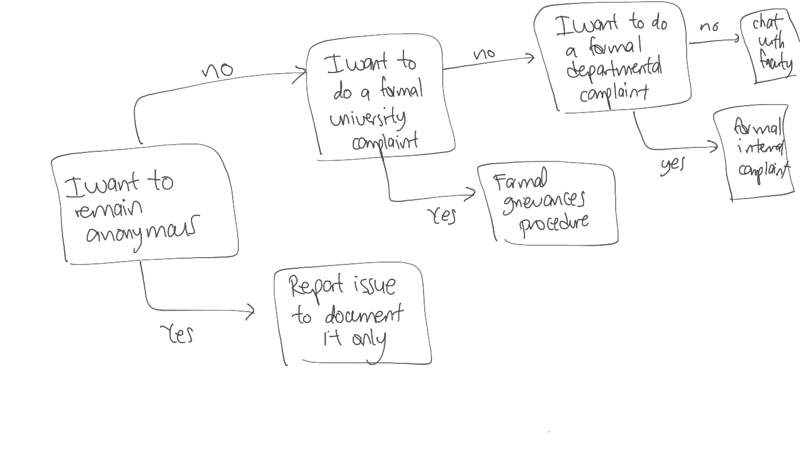

# Reporting options

# Simple reporting protocol

### When to use this option?
- When you only want to document what happened without any further action
- When you do not want to provide your name

### What happens after I report the incident?
- The chair of the JEDI committee will record your report into a spreadsheet which will be viewable by the JEDI committee and the chair of the department only
- ...

### Timeframe
- ...

# Conversation with a faculty protocol

### When to use this option?
- When you are uncertain of what to do and want to discuss your options with someone in the department
- When you do not mind providing your name and contact information

### What happens after I report the incident?
- ...

### Timeframe

# In-house formal complaint

### When to use this option?
- ....
- When you do not mind providing your name and contact information

### What happens after I report the incident?
- ...

### Timeframe

# Formal university grievances procedure

### When to use this option?
- ....
- When you do not mind providing your name and contact information

### What happens after I report the incident?
- ...

### Timeframe
